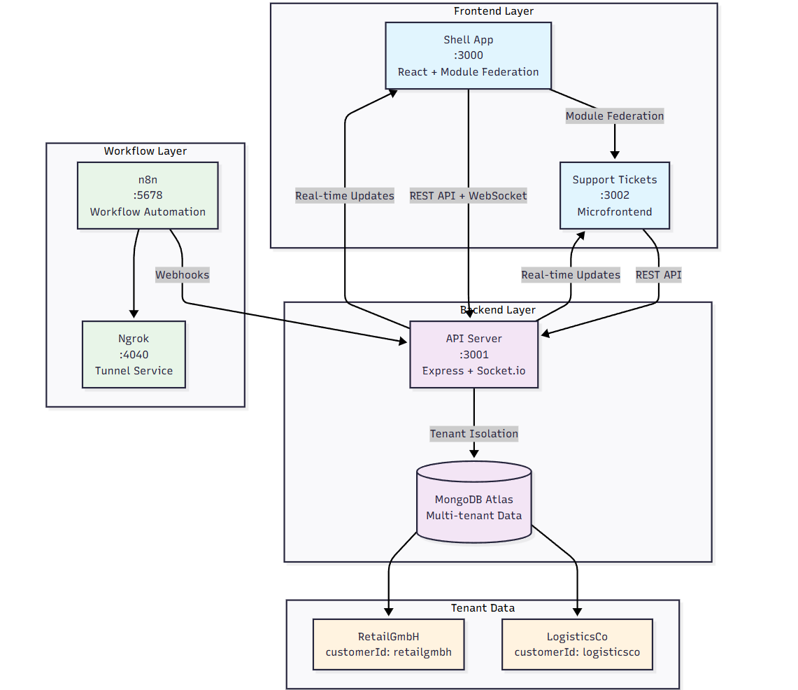

# Flowbit Multi-Tenant Application Documentation

## 📋 Table of Contents

- [Quick Start](#quick-start)
- [Architecture Overview](#architecture-overview)
- [Features](#features)
- [API Endpoints](#api-endpoints)
- [n8n Integration](#n8n-integration)
- [Testing](#testing)
- [Known Limitations](#known-limitations)
- [Troubleshooting](#troubleshooting)

## 🚀 Quick Start

### Prerequisites

- Node.js 18+
- Docker & Docker Compose
- MongoDB Atlas account (or local MongoDB)
- Git

### 1. Clone and Setup

```bash
git clone <your-repo-url>
cd flowbit-multitenant-app
npm install
```

### 2. Environment Configuration

###### 1. Create `.env` file in the root directory:

```env
MONGO_URI=your-mongodb-uri

JWT_SECRET=flowbit-super-secret-key-2024
N8N_WEBHOOK_SECRET=n8n-flowbit-shared-secret-2024

NGROK_AUTH_TOKEN=your-ngrok-token

NODE_ENV=development
PORT=3001
```

###### 2. Create `.env` file in the packages/api directory:

```env
MONGO_URI=your-mongodb-uri
```


###### 3. Update the MONGO_URI and NGROK_AUTH_TOKEN in docker-compose.yml also


### 3. Start Services

```bash
# Start all services with Docker
docker-compose start

# Check if all 5 services are up
docker-compose ps
```

### 4. Seed Database

```bash
# Create initial admin users
npm run seed

# Add additional regular users
npm run users
```

### 5. Setup n8n Workflows

- Head over to packages/api/n8n-manual-setup
- There is a SETUP_INSTRUCTIONS.md file, follow those instructions to setup n8n workflows

### 6. Access Applications

- **Shell App**: http://localhost:3000
- **n8n**: http://localhost:5678

### 7. Test Login Credentials

**LogisticsCo Tenant:**

- Admin: `admin@logisticsco.com` / `password123`
- User: `user@logisticsco.com` / `password123`
- User: `support@logisticsco.com` / `password123`
- User: `driver@logisticsco.com` / `password123`
- User: `warehouse@logisticsco.com` / `password123`
- User: `dispatcher@logisticsco.com` / `password123`

**RetailGmbH Tenant:**

- Admin: `admin@retailgmbh.com` / `password123`
- User: `user@retailgmbh.com` / `password123`
- User: `cashier@retailgmbh.com` / `password123`
- User: `inventory@retailgmbh.com` / `password123`
- User: `sales@retailgmbh.com` / `password123`
- User: `customer-service@retailgmbh.com` / `password123`

## 🏗️ Architecture Overview



### Key Components

1. **Shell Application** (Port 3000)

   - Main application container
   - Module Federation host
   - Authentication & routing
   - Real-time status updates

2. **Support Tickets Microfrontend** (Port 3002)

   - Standalone React application
   - Exposed via Module Federation
   - Tenant-isolated ticket management

3. **API Server** (Port 3001)

   - Express.js REST API
   - Socket.io for real-time communication
   - JWT authentication
   - Tenant isolation middleware

4. **n8n Workflow Engine** (Port 5678)

   - Workflow automation platform
   - Webhook integrations
   - Status update workflows

5. **MongoDB Atlas**
   - Multi-tenant data storage
   - Tenant isolation via customerId
   - User management & audit logs

## ✨ Features

### Multi-Tenancy

- **Tenant Isolation**: Complete data separation by `customerId`
- **Role-Based Access**: Admin and User roles per tenant
- **Tenant-Specific UI**: Customized experience per tenant

### Real-Time Communication

- **Socket.io Integration**: Live updates across all clients
- **Tenant Rooms**: Isolated real-time channels per tenant
- **Status Broadcasting**: Instant status updates from n8n

### Microfrontend Architecture

- **Module Federation**: Dynamic loading of remote applications
- **Independent Deployment**: Each microfrontend can be deployed separately
- **Shared Dependencies**: Optimized bundle sizes with shared React

### Security

- **JWT Authentication**: Secure token-based authentication
- **Webhook Security**: Secret-based webhook validation
- **Tenant Isolation**: Database-level tenant separation

## 🔌 API Endpoints

### Authentication

```
POST /api/auth/login          # User login
GET  /api/auth/me            # Get current user
```

### Tickets

```
GET    /api/tickets          # List tickets (tenant-filtered)
POST   /api/tickets          # Create ticket
GET    /api/tickets/:id      # Get ticket details
PUT    /api/tickets/:id      # Update ticket (Admin only)
```

### Users

```
GET /api/users/me/screens    # Get tenant-specific screens
```

### Webhooks

```
POST /webhook/ticket-done     # n8n ticket completion webhook
POST /webhook/tenant-status   # n8n tenant status webhook
```

### Health Check

```
GET /health                  # API health status
```

## 🔄 n8n Integration

### Webhook Workflows

1. **Tenant Status Updates**

   - **Trigger**: Webhook at `/webhook/tenant-status-trigger`
   - **Purpose**: Send real-time status updates to tenants
   - **Payload**:
     ```json
     {
       "customerId": "logisticsco",
       "status": "Operational|Maintenance|Degraded|Critical",
       "message": "Status description",
       "details": { "additional": "data" }
     }
     ```

2. **Ticket Processing**
   - **Trigger**: Automatic on ticket creation
   - **Purpose**: Process tickets through automated workflows
   - **Integration**: Updates ticket status via webhook

### Testing n8n Integration

```bash
# Test tenant status webhook
npm run test-tenant-status

# Manual curl test
curl -X POST http://localhost:5678/webhook/tenant-status-trigger \
  -H "Content-Type: application/json" \
  -d '{
    "customerId": "logisticsco",
    "status": "Maintenance",
    "message": "Scheduled maintenance in progress"
  }'
```

## 🧪 Testing

### Run Tests

```bash
# API tests
npm run test

# Test tenant status updates
npm run test-tenant-status
```

### Manual Testing Scenarios

1. **Multi-Tenant Isolation**

   - Login as LogisticsCo admin
   - Create tickets
   - Login as RetailGmbH admin
   - Verify no access to LogisticsCo tickets

2. **Real-Time Updates**

   - Open multiple browser windows
   - Login as different users from same tenant
   - Create/update tickets in one window
   - Verify real-time updates in other windows

3. **Status Updates**
   - Trigger n8n webhook
   - Verify status banner appears
   - Check auto-hide after 30 seconds

## ⚠️ Known Limitations

### Technical Limitations

1. **Module Federation Constraints**

   - Microfrontends must use compatible React versions
   - Shared dependencies can cause version conflicts
   - Hot reloading may not work perfectly in development

2. **Socket.io Scaling**

   - Current implementation uses in-memory Socket.io
   - Won't scale across multiple API instances without Redis adapter
   - Connection state lost on server restart

3. **Database Performance**

   - No database indexing optimization implemented
   - Large datasets may impact query performance
   - No connection pooling configuration

4. **Security Considerations**
   - JWT tokens don't have refresh mechanism
   - No rate limiting implemented
   - Webhook secrets stored in plain text

### Functional Limitations

1. **User Management**

   - No user registration flow
   - No password reset functionality
   - No user profile management

2. **Ticket System**

   - No file attachments support
   - No ticket comments/history
   - No email notifications
   - No SLA tracking

3. **n8n Integration**

   - Manual workflow setup required
   - No automatic n8n configuration
   - Limited error handling for webhook failures

4. **Monitoring & Logging**
   - No centralized logging system
   - No application performance monitoring
   - Limited error tracking

### Deployment Limitations

1. **Environment Configuration**

   - Hardcoded URLs in some configurations
   - No environment-specific builds
   - Manual SSL certificate management

2. **Scalability**

   - No load balancing configuration
   - No auto-scaling capabilities
   - Single point of failure for API server

3. **Data Backup**
   - No automated backup strategy
   - No disaster recovery plan
   - Dependency on MongoDB Atlas availability

## 🔧 Troubleshooting

### Common Issues

1. **n8n Connection Failed**

   ```bash
   # Use manual setup instead
   npm run manual-n8n-setup
   ```

2. **Module Federation Loading Errors**

   ```bash
   # Clear browser cache and restart dev servers
   npm run dev
   ```

3. **Socket.io Connection Issues**

   - Check CORS configuration
   - Verify API server is running
   - Check browser console for errors

4. **Database Connection Errors**

   - Verify MongoDB URI in .env
   - Check network connectivity
   - Ensure MongoDB Atlas whitelist includes your IP

5. **Ticket Update Errors**
   - Verify user has Admin role
   - Check API server logs
   - Ensure proper authentication token

### Debug Commands

```bash
# Check API health
curl http://localhost:3001/health

# View API logs
docker-compose logs api

# Check n8n status
curl http://localhost:5678/healthz

# Test webhook directly
curl -X POST http://localhost:3001/webhook/tenant-status \
  -H "X-Webhook-Secret: n8n-flowbit-shared-secret-2024" \
  -H "Content-Type: application/json" \
  -d '{"customerId":"logisticsco","status":"Test","message":"Direct test"}'
```

### Performance Optimization

1. **Database Queries**

   - Add indexes for frequently queried fields
   - Implement pagination for large datasets
   - Use aggregation pipelines for complex queries

2. **Frontend Performance**

   - Implement code splitting
   - Add service worker for caching
   - Optimize bundle sizes

3. **API Performance**
   - Add response caching
   - Implement connection pooling
   - Add request rate limiting

---
